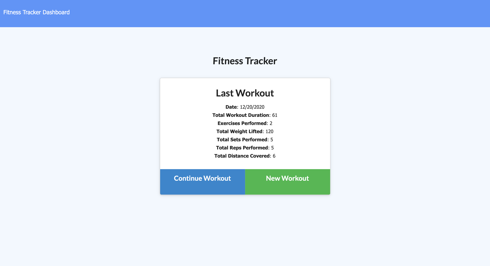
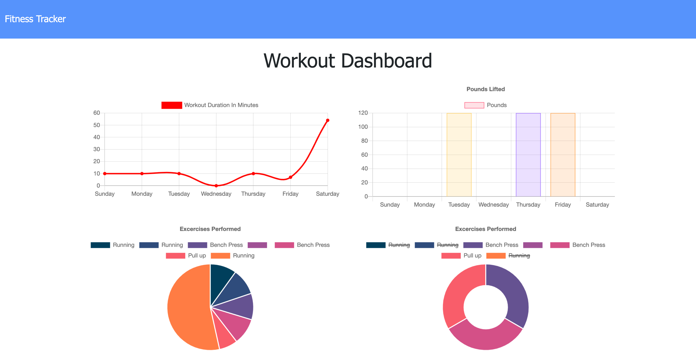

# Fitness Tracker

## Table of Contents

- [Technologies Used](#technologies-used)

- [User Story](#user-story)

- [Business Context](#business-context)

- [Acceptance Criteria](#acceptance-criteria)

- [Installation](#installation)

- [Deployed Link](#deployed-link)

- [Preview](#preview)

- [Questions](#questions)

## Technologies Used

**Language:** Node.js, HTML, CSS

**Dependencies:** Express, Mongoose, Morgan

**Version Control:** GitHub

**Cloud Platform:** Heroku, MongoDB Atlas

## User Story

As a user, I want to be able to view create and track daily workouts. I want to be able to log multiple exercises in a workout on a given day. I should also be able to track the name, type, weight, sets, reps, and duration of exercise. If the exercise is a cardio exercise, I should be able to track my distance traveled.

## Business Context

A consumer will reach their fitness goals more quickly when they track their workout progress.

## Acceptance Criteria

When the user loads the page, they should be given the option to create a new workout or continue with their last workout.

The user should be able to:

- Add exercises to a previous workout plan.

- Add new exercises to a new workout plan.

- View the combined weight of multiple exercises on the `stats` page.

## Installation

To install necessary dependencies, run the following command:

```
npm install
```

## [Deployed Link](https://fitness-tracker-bc.herokuapp.com)

## Preview

---



---

## Questions

If you have any questions about the repo, open issue or contact me directly at [hamisaacs@gmail.com](hamisaacs@gmail.com). You can find more of my work at [Hisaacs](https://github.com/Hisaacs).
